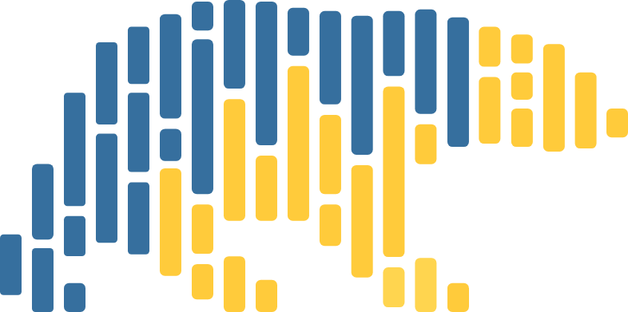

##  whoami

Systems Engineer, Data Engineer, and Automation Enthusiast.

I build infrastructure, automate workflows, manage Linux systems, and move data around at scale while solving business problems.

Most of my projects revolve around:

- Linux
- Terraform
- AWS
- Docker & Kubernetes
- Python Automation
- PostgreSQL
- Data Platforms
- Self-Hosted Infrastructure

I enjoy turning fragile manual processes into reliable automated systems and designing architectures that can survive both growth and human error.

## ls ~/toolbox

    
    
    
    
    
    
    
    
    
    
    

## cat publications

- [*Improvements on scalable and reproducible cloud implementation of numerical groundwater modeling*](https://github.com/jgrove90/jgrove90/blob/d8d1b06e1c187c16e0a8d68ba436e0e5a4e2939c/Groundwater%20-%202026%20-%20Roth%20-%20Improvements%20on%20Scalable%20and%20Reproducible%20Cloud%20Implementation%20of%20Numerical%20Groundwater.pdf) — Roth, M., Grove, J., Davis, A., & Cornell, J. (2025), **Groundwater**.
