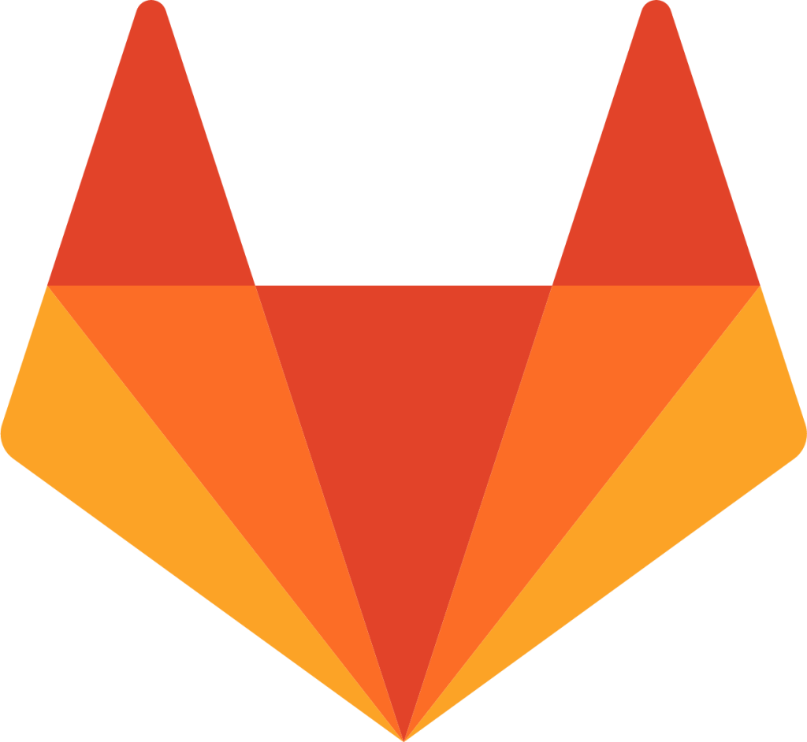

##  Hello 

I'm a passionate coder with a keen interest for automation. I find joy in architecting solutions that leverage technology to solve real-world challenges.

## ⚒️ My Toolbox

    
    
    
    
    
    
    
    
    
    
    
    

