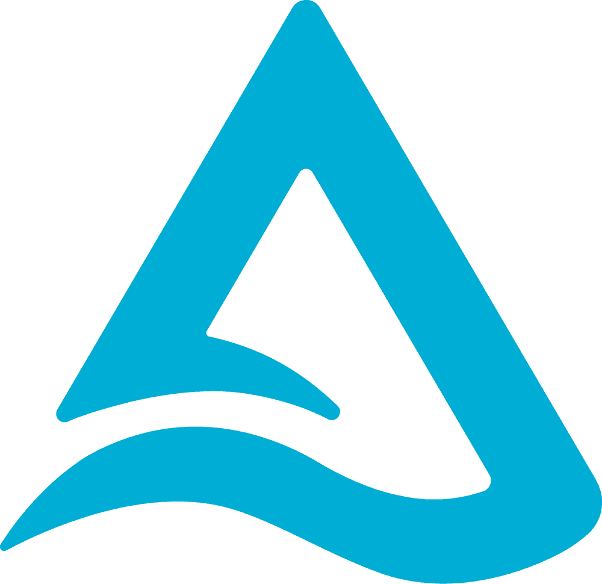
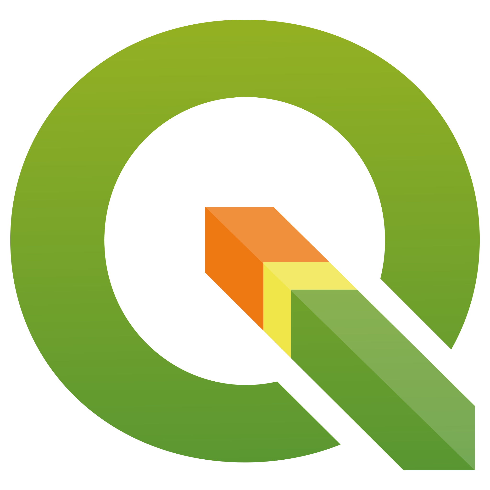

##  Hello 

I'm a passionate coder with a keen interest for data, specifically data engineering. I find joy in architecting solutions that leverage technology to solve real-world challenges. Beyond the screen, I have a unique set of hobbies that bring balance to my life. I'm an amature mycologist that grows gourmet mushrooms and forages on occasion.  When I'm not immersed in code, you'll find me exploring the outdoors on my mountain bike, chasing new trails and breathtaking vistas. Embracing both the digital and natural realms, I'm always excited to embark on new technologies and adventures.

## ⚒️ My Toolbox

    
    
    
    
    
    
    
    
    
    
    
    
    
    
    
    
    
     

  

